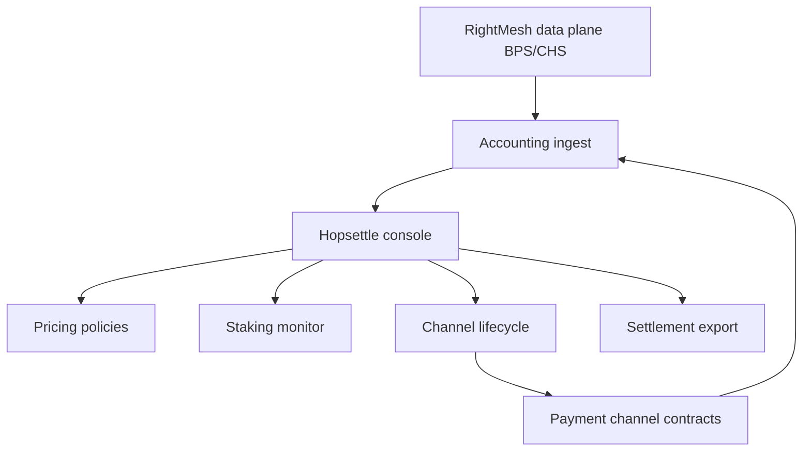

# Hopsettle

**Source:** `ai-in-decentralized+ai/RightMesh_TWP5/`
**Domain:** `ai-decentralized`
**One-liner:** A mesh micropayment channel operations console for seller, buyer, relay, and superpeer operators — managing channel lifecycle, per-packet data accounting, pricing, and staking eligibility across local meshes and global superpeer links.
**Wedge:** RightMesh superpeer and internet-sharing node operators who must run microRaiden-inspired payment channels because smartphones cannot host full crypto nodes — starting with token superpeers staking RMESH to open buyer/seller/relay channels in multi-hop Dhaka–Vancouver-style linked meshes.
**Positioning:** Mesh settlement ops for the transport layer. The technical whitepaper replaces IP/MAC with MeshID (Ethereum address), routes locally over BT/Wi-Fi/Wi-Fi Direct with multipath delay-tolerant transport, links global meshes via SUPERPEER/GATEWAY with NAT hole punching, and embeds micropayment channels in the data transmission protocol so buyers pay superpeers per packet and superpeers pay sellers and relays. Hopsettle is the operator console for that economics — distinct from Denselink (developer density) and Relaymint (sponsor campaign marketplace).

## Market research synthesis

### Thesis from source

The RightMesh technical whitepaper (v5.0, March 2018) describes a decentralized mobile mesh platform where centralized architectures fail in infrastructure-less or internet-less contexts. Core technology includes MeshID as identity (Ethereum address instead of IP/MAC), MeshPorts for multiplexing apps on a shared mesh service, internal roles (MASTER, CLIENT, ROUTER), and additional GATEWAY and SUPERPEER roles for global linking.

Local mesh connectivity uses Wi-Fi, Bluetooth, and Wi-Fi Direct with packet priorities and multipath routing; the paper notes that if each hop's success drops to 90%, end-to-end success across multiple hops falls sharply (example: ~34.9% for a chain), motivating robust routing and incentivised relays. Global connectivity links separate meshes (e.g., Vancouver and Dhaka) through superpeers that translate Internet traffic, perform hole punching, and maintain topology INFO for logical connectivity graphs. App developers may deploy trusted app superpeers for specialised workloads (e.g., geocaching sensors in remote areas).

Micropayment channels — based on microRaiden at the superpeer layer — let devices sell internet data into the mesh at self-set prices. Token superpeers run full Ethereum nodes because phones cannot; they stake tokens, act as payment hubs, and open/close channels with REMOTEPEER buyers and sellers. The data transmission protocol attaches buyer payment signatures (BPS) and seller closing-hash signatures (CHS) to DATA and DATA_ACK packets; superpeers account for bytes relayed, create reciprocal signatures, and maintain channel balance tables. Channel establishment uses GET_ALL discovery to query smart contracts for existing buyer→superpeer and superpeer→seller channels, returning RMESH and ETH balances before signed channel-open transactions.

Open-source token superpeer reference implementation assumes sufficient token float to fund new channels; operator community may compete on channel strategy. Economic roles include internet-sharing sellers, data-requesting buyers, relays, and superpeers — with open questions in the paper about how many consumers one superpeer can support and how relay devices might earn tokens in future multi-superpeer topologies.

### Buyer & economic model

- **Primary buyer:** independent superpeer operator or mesh ISP partner running token superpeers at geographic edges (Canada, Bangladesh examples in the paper).
- **Users:** network operations engineers monitoring channel health, pricing analysts setting per-MB or per-packet rates, finance reconciling RMESH/ETH flows, app developers operating app superpeers with custom channel policies.
- **Budget owner / value metric:** mesh operator P&L; value metric is net RMESH margin after staking and gas, channel utilisation, and settlement accuracy versus bytes accounted in the transmission protocol.
- **Competing status quo:** manual spreadsheet tracking of informal internet sharing, flat-rate mesh access without per-hop accounting, or running raw microRaiden tooling without mesh-specific packet semantics.

### Domain constraints

- **Regulatory / trust / safety:** token and securities context from RightMesh legal disclaimers; telecom/regulatory questions when reselling connectivity; smart-contract risk on channel close; need for kill-switch when superpeer token float is exhausted (paper notes low balance stops channel creation).
- **Data sensitivity:** settlement records contain MeshIDs and volume, not necessarily end-user personal profiles; payment tables are commercially sensitive.
- **Change-management realities:** operators cannot rewrite the mesh library; Hopsettle must observe live BPS/CHS accounting and contract state read-only with controlled channel open/close commands.

## Business requirements

- BR-1: Operators must see live channel status (buyer→superpeer, superpeer→seller, relay paths) with RMESH and ETH balances per MeshID.
- BR-2: Per-packet data accounting from the transmission protocol must reconcile to channel balance updates within a defined tolerance.
- BR-3: Pricing policies must support seller-set rates and superpeer markup rules without breaking protocol-enforced BPS/CHS semantics.
- BR-4: Staking eligibility for token superpeers must track minimum RMESH float before new channels are offered, per reference implementation assumptions.
- BR-5: Channel open and close workflows must mirror GET_ALL discovery and smart-contract channel existence checks described in the paper.
- BR-6: Multi-hop routes involving relays must attribute accounted bytes to relay compensation rules when enabled.
- BR-7: Operators must receive alerts before superpeer token depletion blocks new channel creation.
- BR-8: App superpeer deployments must be distinguishable from token superpeers with separate channel policies and trust boundaries.
- BR-9: Cross-mesh scenarios (two superpeers linking Dhaka and Khulna meshes) must aggregate settlement per geographic mesh attachment.
- BR-10: Disputes between buyers and sellers on accounted volume must reference packet-level signature logs exportable for arbitration.
- BR-11: Gateway and hole-punch failures must surface as settlement-blocking events when DATA packets cannot complete paid paths.
- BR-12: Historical settlement exports must tie RMESH movements to channel close events for finance audit.

## User stories

Canonical user stories live in sibling [USER_STORIES.md](USER_STORIES.md).

## System design

### Overview

Hopsettle ingests mesh transmission accounting (BPS/CHS tables, GET_ALL channel discovery results, smart-contract channel state) and presents operator workflows for pricing, staking, channel lifecycle, and settlement. It does not implement the mesh protocol; it is the control plane for roles defined in the technical whitepaper — token superpeers, sellers, buyers, relays — across local mesh and superpeer-linked global topologies.

### Actors & boundaries

- **Actors:** token superpeer operator, app superpeer operator, seller, buyer, relay, finance, platform admin; RightMesh library and Ethereum contracts as external systems.
- **Trust boundary:** Hopsettle reads protocol and chain state; signing keys remain in operator HSM or device vaults with policy-gated commands.
- **Human-in-the-loop points:** pricing changes; channel force-close; dispute review; staking top-up decisions.

### Core capabilities

1. **Channel lifecycle management** — discover, open, monitor, close buyer/superpeer/seller channels.
2. **Data accounting reconciliation** — packet signatures vs channel balances.
3. **Pricing and markup policies** — seller rates, superpeer fees, relay shares.
4. **Staking and float monitoring** — RMESH eligibility for hub operations.
5. **Role topology view** — MASTER/CLIENT/ROUTER/GATEWAY/SUPERPEER/REMOTEPEER context.
6. **Settlement and export** — RMESH/ETH movements, period statements.
7. **Dispute and quarantine** — signature mismatch investigation.

### Conceptual data

- **Primary entities:** MeshOperator, SuperpeerNode, PaymentChannel, ChannelBalance, PacketAccountingEntry, PricingPolicy, StakingAccount, SettlementStatement, Dispute, MeshAttachment.
- **Critical events:** channel discovered, channel opened, DATA accounted, CHS acknowledged, channel closed, float threshold breached, dispute opened.
- **Retention / audit needs:** signature and balance history for commercial dispute windows; MeshIDs as pseudonymous identifiers.

### Integrations (conceptual)

- **Systems of record:** RightMesh token superpeer reference implementation, microRaiden/Ethereum payment channel contracts, mesh telemetry APIs.
- **Upstream signals:** GET_ALL discovery packets, BPS/CHS logs, smart-contract channel state, superpeer token balances.
- **Downstream actions:** channel open/close transactions (policy-gated), operator alerts, pricing updates pushed to superpeer config, exports to Relaymint attestation feeds.

### High-level architecture

### Success metrics

- **Leading:** channel open success rate; accounting mismatch rate; median superpeer float above minimum; packets settled vs transmitted.
- **Lagging:** operator net RMESH margin; buyer dispute rate; seller retention; superpeer uptime across linked meshes; relay compensation when enabled.

## OpenAPI skeleton

Canonical HTTP surface lives in sibling [openapi.yaml](openapi.yaml). Summary:

- **Base path:** `/v1/...`
- **Auth:** `X-API-Key` for superpeer agent integrations; Bearer JWT for operator consoles.
- **Resource groups:** Channels, Accounting, Pricing, Staking, Settlement, Reporting.
