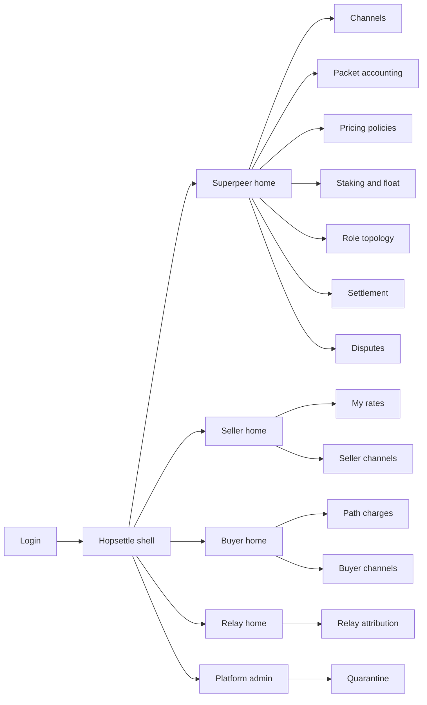
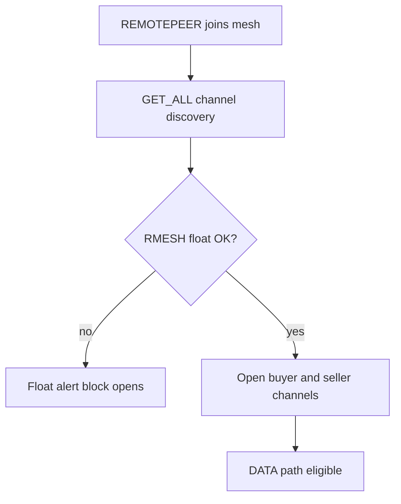
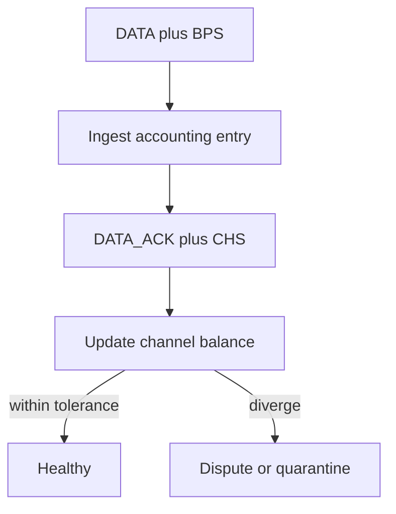

# Hopsettle — Web app

**Product:** [PRODUCT.md](./PRODUCT.md)
**Primary surface:** Mesh micropayment channel operations console (superpeer / seller / buyer / relay roles under one Hopsettle shell)
**Secondary surfaces:** Finance settlement statement export (read-only); packet-signature dispute evidence viewer; platform quarantine board
**Design thesis:** Hopsettle is a clearing floor for mesh hops, not a “Web3 wallet dashboard.” The metaphor is a radio ops board crossed with a payment-channel ledger: every DATA path must show buyer→superpeer→seller (and relay) channels, BPS/CHS signatures, and RMESH float before unpaid packets look successful. Visual language is night-ops graphite with signal-cyan for healthy multipath and float-amber when staking cannot fund new channels. The Hopsettle wordmark sits like a mesh callsign on every money-bearing channel view so operators know whose settlement table they are trusting across Dhaka–Vancouver-style linked meshes.

## UX research synthesis

### Category peers (best-in-class)

- **Ride The Lightning / ThunderHub (Lightning):** Channel open/close, local vs remote balance, fee policies, forced-close warnings. Steal: channel-as-primary object with balance bars and close-risk chrome; reject Bitcoin-only jargon where Hopsettle speaks MeshID / RMESH / BPS/CHS.
- **Helium Hotspot / Console (IoT coverage ops):** Geographic attachment, role of the node, earnings vs relay. Steal: mesh attachment geography and role clarity (token vs app superpeer); reject consumer hotspot gamification badges.
- **Althea exit-node / payment-routing UIs:** Per-hop price for connectivity resale. Steal: seller-set rate + hub markup visibility for buyers; reject burying per-packet charges behind a single “plan” price.
- **microRaiden / Raiden Hub operator tooling:** Hub float, channel capacity, GET_ALL-style discovery of existing channels. Steal: float-before-open gate and discovery-before-create; reject generic DeFi portfolio chrome.

### Patterns to adopt / reject

- **Adopt:** Dual channel tables (buyer→superpeer and superpeer→seller); live BPS/CHS reconciliation tolerance; float kill-switch alerts before new channels block; seller price + superpeer markup on one path explain; MeshAttachment geography for cross-mesh settlement; signature-log export for volume disputes; gateway/hole-punch failures as settlement-blocking banners.
- **Reject:** Token-price charts as the home screen; “AI routing insights” purple panels; editable accounted bytes; treating live mesh telemetry as settled RMESH; one wallet balance for all roles; card grids of vanity TVL.

### Trust, density, and workflow constraints from PRODUCT.md

Operators need finance-grade channel density without exposing peer commercial secrets beyond their role (buyer must see path charges, not seller’s full P&L). Signing keys stay off the webapp — policy-gated open/close only (system design). Staking float must gate new channels (BR-4, BR-7). Accounting must reconcile packet signatures to balances within tolerance (BR-2) or quarantine (admin story). App superpeers need a distinct trust boundary from token superpeers (BR-8). Gateway failures block paid paths visually (BR-11). Disputes require exportable signature evidence (BR-10).

## Information architecture

### Nav model

### Roles → default home

| Role | Default home | Why |
|------|--------------|-----|
| Token superpeer operator | Superpeer home — float + open channels | Hub economics (BR-1, BR-4, BR-7) |
| App superpeer operator | App superpeer home — policy boundary | Distinct trust (BR-8) |
| Internet-sharing seller | Seller home — rate vs CHS ack | Earn on bytes (BR-3) |
| Data buyer | Buyer home — path charge explain | No markup surprises |
| Relay operator | Relay attribution | Byte share when enabled (BR-6) |
| Finance analyst | Settlement statements | Period RMESH reconcile (BR-12) |
| Platform administrator | Quarantine board | Signature divergence |

### Cross-links to OpenAPI resources

| Nav area | OpenAPI tags / resources |
|----------|---------------------------|
| Channels lifecycle | Channels |
| BPS/CHS reconciliation | Accounting |
| Seller rates / markup | Pricing |
| RMESH float eligibility | Staking |
| Statements / closes | Settlement |
| Operator exports | Reporting |

## Screen inventory

### Superpeer home

- **Purpose:** Answer “can I fund new channels, and are open channels reconciling packet accounting?”
- **Entry:** Default for token superpeer operators.
- **Layout regions:** Brand + mesh attachment switcher (e.g. Dhaka / Vancouver); float health (RMESH above minimum, ETH gas headroom); channel summary (buyer/seller open counts); mismatch alert rail; gateway/hole-punch status.
- **Primary actions:** Top up float; open channel after GET_ALL; open mismatched accounting; jump to settlement.
- **Empty / loading / error:** Empty = connect first superpeer agent; float below min = blocking banner (cannot offer channels).
- **BR / story ties:** BR-1, BR-4, BR-7, BR-11; superpeer operator stories.

### Channel list and lifecycle

- **Purpose:** Discover, open, monitor, and close buyer→superpeer and superpeer→seller channels with contract-backed existence checks.
- **Entry:** Superpeer / seller / buyer nav → Channels.
- **Layout regions:** Role-filtered table (MeshID, direction, RMESH/ETH balances, state); discovery panel (GET_ALL results); open wizard (REMOTEPEER, capacity, policy); close drawer with settlement preview.
- **Primary actions:** Run discovery; open channel; force-close with reason; drill to accounting.
- **Empty / loading / error:** Contract query fail = negative-path reject (no unpaid DATA); loading = skeleton + last-known balances dimmed.
- **BR / story ties:** BR-1, BR-5; open/close stories.

### Packet accounting reconciliation

- **Purpose:** Show BPS/CHS entries vs channel balance updates within tolerance.
- **Entry:** Channel row; Accounting nav; mismatch alert.
- **Layout regions:** Entry table (packet id, bytes, BPS, CHS, timestamp); tolerance meter; divergence highlighter; export for dispute.
- **Primary actions:** Mark reviewed; open dispute; quarantine escalate.
- **Empty / loading / error:** Empty channel = “awaiting DATA”; ingest lag = stale watermark.
- **BR / story ties:** BR-2, BR-10.

### Pricing policies

- **Purpose:** Set seller rates and superpeer markup without breaking protocol signature semantics.
- **Entry:** Seller home; Superpeer Pricing.
- **Layout regions:** Seller rate editor (per-MB / per-packet); markup rules; path preview (buyer-visible total); effective-at schedule; app-superpeer policy set (separate).
- **Primary actions:** Publish rate; simulate buyer path cost; revert to last protocol-compatible policy.
- **Empty / loading / error:** Validation if policy would desync BPS expectations.
- **BR / story ties:** BR-3, BR-8; seller and buyer stories.

### Staking and float monitor

- **Purpose:** Track minimum RMESH float eligibility and alert before channel creation stops.
- **Entry:** Superpeer home; Staking nav.
- **Layout regions:** Float gauge vs minimum; projected runway at current open rate; top-up instructions; kill-switch history when float exhausted.
- **Primary actions:** Acknowledge alert; record top-up; pause new channel offers manually.
- **Empty / loading / error:** Agent disconnect = unknown float (treat as risk).
- **BR / story ties:** BR-4, BR-7.

### Role topology and mesh attachments

- **Purpose:** Contextualise MASTER/CLIENT/ROUTER/GATEWAY/SUPERPEER/REMOTEPEER and cross-mesh geography.
- **Entry:** Topology nav; home mesh switcher detail.
- **Layout regions:** Logical graph of roles; MeshAttachment list (e.g. Dhaka–Khulna link); gateway health; app vs token superpeer badges.
- **Primary actions:** Filter by attachment; open channels for a node; inspect gateway failure.
- **Empty / loading / error:** No telemetry = last topology snapshot with age.
- **BR / story ties:** BR-8, BR-9, BR-11.

### Path charges (buyer)

- **Purpose:** Explain per-packet charges along multi-hop routes including superpeer markup.
- **Entry:** Buyer default; channel detail.
- **Layout regions:** Route hops; fee stack (seller + markup + relay share if any); cumulative RMESH for sample window; dispute CTA.
- **Primary actions:** Export charge explain; open dispute on accounted volume.
- **Empty / loading / error:** No paid path = gateway/hole-punch block explanation.
- **BR / story ties:** BR-3, BR-6, BR-11; buyer stories.

### Relay attribution

- **Purpose:** Attribute forwarded DATA bytes for relay compensation when enabled.
- **Entry:** Relay operator home.
- **Layout regions:** Forwarded byte table by channel/path; compensation rule status (enabled/pending); payout estimate.
- **Primary actions:** Export attribution; flag missing credit.
- **Empty / loading / error:** Rules disabled = clear “relay share not enabled on this superpeer.”
- **BR / story ties:** BR-6; relay operator stories.

### Settlement statements

- **Purpose:** Period RMESH/ETH movements tied to channel close events for finance audit.
- **Entry:** Finance home; Settlement nav.
- **Layout regions:** Statement list by mesh attachment; line items (open, account, close); export CSV/PDF; link to signature slice.
- **Primary actions:** Close period export; drill to channel close event.
- **Empty / loading / error:** Empty period = no closes; immutable styling on exported statements.
- **BR / story ties:** BR-12; finance analyst stories.

### Disputes workspace

- **Purpose:** Resolve buyer/seller volume disagreements with packet-level signature evidence.
- **Entry:** Alerts; accounting divergence; Disputes nav.
- **Layout regions:** Queue; dual evidence panes (buyer claim vs superpeer log); tolerance context; resolution log.
- **Primary actions:** Submit evidence export; accept adjustment policy; escalate quarantine.
- **Empty / loading / error:** Empty = no open disputes; expired evidence window locked.
- **BR / story ties:** BR-10; buyer dispute story.

### Quarantine board (platform admin)

- **Purpose:** Quarantine superpeers whose signature accounting diverges; block unpaid paths when contract queries fail.
- **Entry:** Admin default.
- **Layout regions:** Quarantine queue; mismatch metrics; MeshID identity; release/keep with reason; negative-path rejection log.
- **Primary actions:** Quarantine; release; notify attached buyers/sellers.
- **Empty / loading / error:** Empty = healthy mesh message.
- **BR / story ties:** BR-2, BR-5, BR-11; admin stories.

## Key flows

1. **Open channels on REMOTEPEER join** — GET_ALL discovery → check float → open buyer and seller channels → ready for DATA; failure: float below minimum or contract query fail → no channel, alert.

2. **Packet settle loop** — DATA with BPS → account bytes → CHS on ACK → balance update within tolerance; failure: divergence → dispute/quarantine.

3. **Seller sets price** — publish rate → superpeer markup rules → buyer path preview updates; failure: policy incompatible with protocol → reject publish.

4. **Float depletion runway** — threshold breach alert → operator tops up or pauses offers → channel creation resumes when eligible (BR-7).

5. **Cross-mesh settlement export** — select MeshAttachments → period statement of opens/closes/net RMESH → finance archive (BR-9, BR-12).

## Design system

### Tokens (CSS variables)

- `--color-ink: #E6EEF2` — primary text on dark ground
- `--color-ops-950: #0A1014` — app ground (night ops)
- `--color-ops-900: #121A22` — panels
- `--color-ops-700: #2A3844` — rules
- `--color-signal: #3DB8C5` — healthy multipath / reconciled (cyan, not purple)
- `--color-signal-dim: #1A5C64` — signal on dark
- `--color-float: #D4A017` — staking / float risk
- `--color-block: #E85D4C` — gateway fail / quarantine
- `--color-steel: #7A8B99` — secondary labels
- `--color-brand: #8FD0D8` — Hopsettle callsign accent
- `--font-display: "Space Grotesk", sans-serif` — console titles and KPIs
- `--font-mono: "IBM Plex Mono", monospace` — MeshIDs, channel ids, BPS/CHS hashes
- `--font-body: "IBM Plex Sans", sans-serif` — forms and tables
- `--space-1`…`--space-8`: 4px scale
- `--radius-sm: 4px`; `--radius-md: 8px` — sharp ops, not pill-heavy
- `--motion-signal: 180ms ease-out` — reconcile flash
- `--motion-float: 240ms ease-in-out` — float amber pulse
- `--motion-path: 320ms ease-in-out` — hop highlight on path explain
- Atmosphere: subtle hexagonal mesh grid in ops-900; soft top vignette; no neon wallet-glow heroes.

### Typography & brand

- Grotesk display for KPIs and screen titles; mono for MeshIDs, signatures, balances; sans for dense tables.
- Hopsettle wordmark left of shell chrome on every channel/settlement view — never replaced by generic “Dashboard.”
- Login shell: brand as hero; one headline (“Settle every mesh hop”); one CTA — no token-price ticker.

### Do / don’t

- **Do:** Show discovery before open; freeze open when float is below minimum; dual-pane signature evidence in disputes; separate app vs token superpeer policies; mark gateway failures as settlement-blocking.
- **Don’t:** Purple Web3 glow; editable byte totals; TVL vanity home; emoji “gm” status; rounded-full pills for every filter; conflate wallet portfolio with channel ops.

### Accessibility & domain trust cues

- Contrast AA+ on signal/float/block against ops ground; channel state also in text (“Reconciled”, “Diverged”, “Float blocked”).
- Live regions announce float threshold and quarantine events.
- Focus order follows money: discovery → open → accounting → settlement.
- Exports include machine-readable signature slices for arbitration.

## Component patterns

- **ChannelBalanceBar** — local/remote RMESH capacity with role direction.
- **FloatGauge** — minimum eligibility + runway + kill-switch state.
- **BpsChsReconcileRow** — packet entry with tolerance status.
- **PathChargeExplain** — hop stack of seller rate + markup + relay share.
- **MeshAttachmentSwitch** — geographic mesh context for settlement.
- **GatewayBlockBanner** — settlement-blocking hole-punch/gateway failure.
- **DiscoveryPanel** — GET_ALL existing channel results before create.
- **DisputeEvidenceExport** — signature log pack for arbitration.
- **RoleWorkspaceSwitch** — Superpeer / Seller / Buyer / Relay / Admin.

## Out of scope for v1 web

- Implementing the RightMesh data plane or mobile mesh library; custodial key custody / in-browser signing of BPS/CHS; Denselink developer density tools; Relaymint sponsor campaign marketplace; consumer end-user chat app; full Ethereum block explorer; native mobile trader apps.
